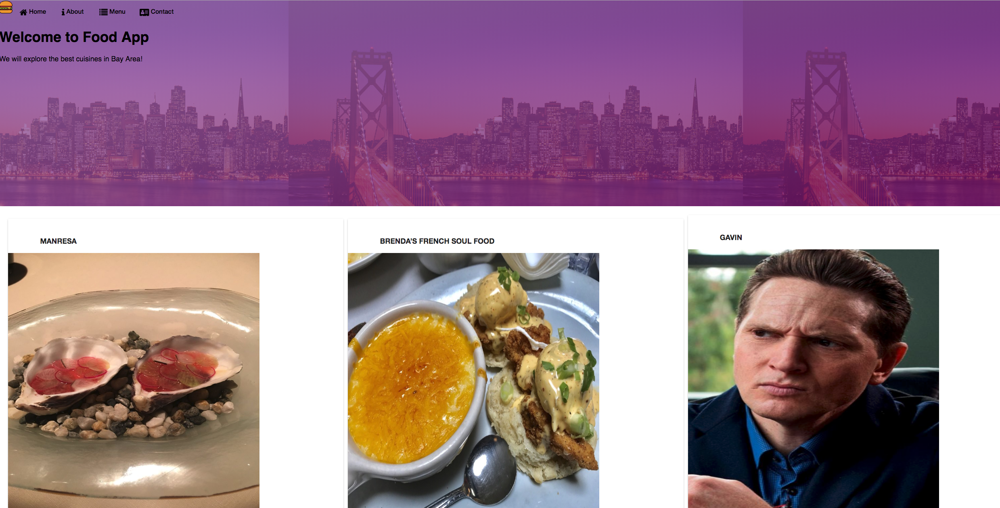
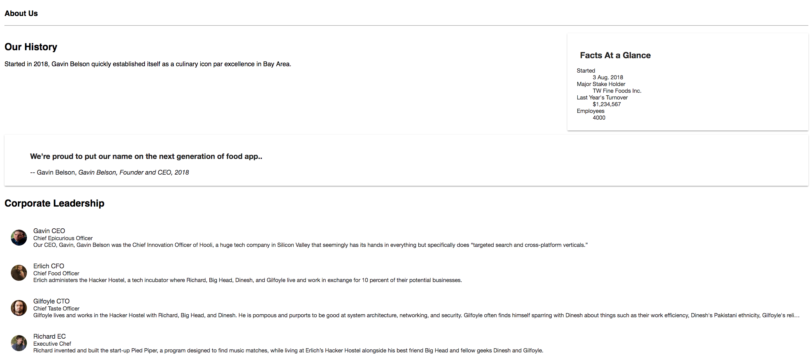

# AngularFoodApp
This project was generated with [Angular CLI](https://github.com/angular/angular-cli) version 6.1.1.

## Install related 
- node : v10.8.0
- nvm: 6.2.0
- mongoDB

## Build
- Run `ng build --prod`. The build artifacts will be stored in the `dist/` directory.
- Copy the contents of the dist folder to the public folder.

## Quick start
- in the mongo folder, type `mongod --dbpath=data --bind_ip 127.0.0.1`.
- in the project folder, type `node server`

## Demo

### Home

### Menu

### Dish

### AboutMe

